# Blender Workbench

Reusable helpers for Blender visual experiments where the goal is not one lucky render, but a traceable parameter sweep with contact-sheet tiles and metadata.

This repo grew out of the lighting/plume studies in the neighboring Blender scene lab. The main lesson: agents should not hand-roll a new sweep harness every time. Define a parameter object, write one scene builder, render a matrix, inspect the tiles, then promote the best setting back into the scene.

## What This Provides

- `blender_workbench.sweep`: render a list/grid of variants, write raw/finished PNGs, role-tagged metadata, README, contact sheets, and selected hero renders promoted from sweep metadata.
- `blender_workbench.camera`: orbit-camera helpers plus lens/distance matching for perspective studies.
- `blender_workbench.capabilities`: inspect local Blender, postprocess, video, PDF, and wrapper tool readiness.
- `blender_workbench.example_manifest`: inspect example commands, expected outputs, docs assets, generated-input prerequisites, and required local tools.
- `blender_workbench.materials`: small material helpers with explicit alpha, emission, and subsurface semantics.
- `blender_workbench.postprocess`: reuse one raw render for finishing-look contact sheets.
- `blender_workbench.primitives`: reusable low-cost scene primitives such as feathered horizon/light bands.
- `blender_workbench.presets`: starter axes, render profiles, and tile layouts for common visual experiments.
- `blender_workbench.promote`: promote a picked tile from an existing `metadata.json` without rerendering the full sheet.
- `blender_workbench.recipes`: optional domain recipes, including a fast rocket vacuum plume scout.
- `examples/camera_perspective_scout.py`: same-view lens and scene-depth cue stride board.
- `examples/gobo_lighting_scout.py`: projected-shadow/gobo lighting board from the BlenderArt lighting resources.
- `examples/mesh_light_scout.py`: same-view emissive mesh/softbox lighting stride board.
- `examples/soft_atmosphere_scout.py`: feathered haze/light-card tuning board for edge falloff, alpha, glow, and noise.
- `examples/subsurface_scout.py`: subsurface material board for wax, jelly, opal, roughness, and backlight.
- `examples/sunset_haze_scout.py`: ordered filmstrip for static dusk, moonrise, and afterglow haze.
- `examples/terrain_environment_scout.py`: same-view landscape/environment mood board for relief, strata, haze, backlight, and foreground scale.
- `examples/transparency_scout.py`: transparency, transmission, roughness, IOR, tint, and thickness board.
- `examples/mini_plume_sweep.py`: a compact Blender script showing the intended workflow.
- `examples/postprocess_look_scout.py`: one raw render processed into a finishing-look contact sheet.
- `examples/light_texture_scout.py`: named light-jitter and texture-magnitude board.
- `examples/rocket_plume_scout.py`: a stronger plume use case built on the general sweep API.
- `examples/rocket_plume_texture_scout.py`: dense plume texture board from smooth through overdone to whiteout.
- `examples/silhouette_shape_scout.py`: blind unlabeled shape-first board for silhouette judgment.
- `examples/manifest.json`: runnable-example manifest for clean-checkout preflights and docs refresh order.
- `docs/parameter-sweep-pattern.md`: the short operating pattern for future agents.
- `docs/performance.md`: defaults for fast basics-first exploration.
- `docs/learning-notes.md`: short map from local BlenderArt resources to implemented sweep ideas.
- `docs/source-translation.md`: ledger workflow for translating old Blender PDF lessons into current helpers.
- `docs/rocket-plume.md`: recipe notes for broad, smoky, in-space engine plumes.
- `tools/pdf_triage.py`: capture local PDF extraction/rendering capability and create learning-note stubs under `runs/`.
- `tools/pdf_lesson_index.py`: maintain a structured PDF lesson index and next-skim queue.
- `tools/reference_manifest.py`: verify the adjacent `../reference_materials` shelf by checksum, size, and derived-resource fingerprints.
- `tools/workbench_doctor.py`: machine-readable and human-readable local capability preflight.
- `tools/sweep_review_page.py`: generate static `review.html` pages for full-size sweep tile inspection.
- `tools/example_pick_smoke.py`: opt-in low-sample Blender smoke checks for example `--pick` promotion paths.
- `tools/sweep_promotion_status.py`: scan sweep outputs for grids that still need a visual pick and selected render.

## Quick Start

Run an example through Blender:

```bash
/Applications/Blender.app/Contents/MacOS/Blender --background --python examples/mini_plume_sweep.py
```

The example writes to `examples/output/mini_plume_sweep/`.

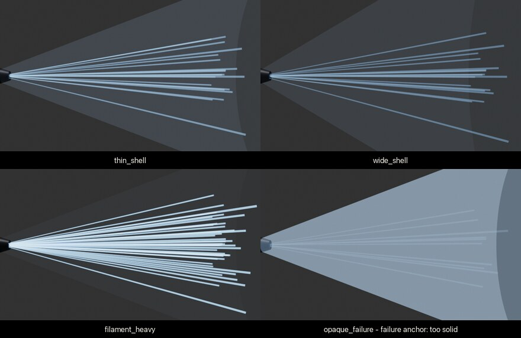

To triage a local learning PDF before turning it into a recipe or issue:

```bash
python3 tools/reference_manifest.py verify
python3 tools/pdf_lesson_index.py build ../reference_materials/artistic_blender_pdfs
python3 tools/pdf_lesson_index.py next
python3 tools/pdf_triage.py ../reference_materials/artistic_blender_pdfs/blenderart_issue_39_compositing_sep_2012.pdf
python3 tools/pdf_lesson_index.py mark --source blenderart_issue_39_compositing --pages 8-10 --status triaged --triage-output runs/pdf_triage/blenderart_issue_39_compositing_sep_2012
```

The reference manifest verifies that local PDFs and SpaceX-derived visual references are present and unchanged before an agent downloads or regenerates media. The lesson index records page counts, statuses, tags, and links from source ranges to triage outputs, coverage rows, issues, or examples. The source translation ledger keeps old Blender UI/API terms from leaking into current workbench code. The PDF helper writes backend status, any extracted text, native macOS page images/contact sheets when available, cover thumbnails, and a `notes.md` stub under `runs/pdf_triage/`.

Check example prerequisites before running a docs refresh or dependent example:

```bash
python3 tools/example_preflight.py
python3 tools/example_preflight.py --name postprocess_look_scout
python3 tools/example_preflight.py --ready-only --max-cost quick --sort-by-cost
python3 tools/example_preflight.py --check-tools --json
python3 tools/workbench_doctor.py
```

For dependent examples, the report prints the exact upstream command needed to create missing generated inputs. Cost-aware reports show runtime bucket, render profile, engine, mode, and tile count so agents can choose a cheap scout before starting heavier Cycles work.

`--check-tools` upgrades example status from file-only readiness to `ready`, `blocked_missing_prereq`, or `blocked_missing_tool` using each manifest entry's `required_capabilities`. `workbench_doctor.py` gives the broader machine receipt for Blender, ImageMagick postprocess/contact sheets, video-reference tooling, PDF triage backends, and Python importability.

Before opening a PR that adds or rewires an example `--pick` path, run a cheap selected-render smoke check:

```bash
python3 tools/sweep_promotion_status.py --require-promoted
python3 tools/example_pick_smoke.py --name soft_atmosphere_scout
python3 tools/example_pick_smoke.py --name soft_atmosphere_scout --run --hero-samples 4
```

The promotion-status command surfaces grids that still need a visual pick or have stale selected-render provenance. The smoke helper prints the planned Blender command from existing `metadata.json`; with `--run`, it verifies `selected.json`, source-sweep provenance, and rendered output files.

## Agent Loop

1. Define a small dataclass or dict of meaningful parameters.
2. Write `build_scene(settings)` so it constructs the entire scene from those parameters.
3. Use `render_sweep(...)` with one fixed camera first.
4. Inspect `contact_sheet.png`.
5. Widen or narrow the sweep based on what the sheet shows.
6. Render the chosen tile with `render_selected_from_sweep(...)` before folding it into the main scene.
7. For noise, texture, jitter, or placement-heavy winners, run `render_selected_replicates_from_sweep(...)` across a few seeds/phases before promotion.
8. When viewport inspection would help, add `save_blend=True` or use an example's `--save-blend` / `--export-blend-only` path and open the saved `.blend`.

## Design Bias

Prefer fast diagnostic sweeps before expensive hero bakes. A good sweep makes failure modes visible: too opaque, too noisy, too flat, wrong color, bad framing, over-bloomed, under-structured.

Generated renders belong in ignored output directories, not the repo history.

## Starter Defaults

Useful imports for new experiments:

```python
from dataclasses import replace

from blender_workbench.presets import RENDER_PRESETS, SWEEP_AXES, TILE_PRESETS, seed_stride_axis, stride_axis, two_axis_variants
from blender_workbench.sweep import named_variants, render_selected_from_sweep, render_selected_replicates_from_sweep, render_sweep

variants = two_axis_variants(
    SWEEP_AXES["plume_alpha_strength"],
    SWEEP_AXES["plume_shape"],
    base={"samples": 48},
)

render_sweep(
    variants=variants,
    build_scene=build_scene,
    out_dir=OUT,
    config=replace(RENDER_PRESETS["cycles_preview"], tile=TILE_PRESETS["micro_grid"]),
    promotion_command="/Applications/Blender.app/Contents/MacOS/Blender --background --python examples/my_scout.py -- --pick {pick}",
)

render_selected_from_sweep(
    sweep_dir=OUT,
    pick="balanced_bell",
    build_scene=build_scene,
    config=RENDER_PRESETS["hero_check"],
    save_blend=True,
)

render_selected_replicates_from_sweep(
    sweep_dir=OUT,
    pick="balanced_bell",
    build_scene=build_scene,
    config=RENDER_PRESETS["hero_check"],
    seeds=(0, 1, 2),
    phases=(0.0, 0.33),
)
```

If you only have the generated sweep folder, promote from `metadata.json` and a recipe builder:

```bash
PYTHONPATH=src /Applications/Blender.app/Contents/MacOS/Blender --background --python-expr \
'import blender_workbench.promote as p; p.main(["--sweep", "examples/output/mesh_light_scout", "--pick", "mesh_fill_p1", "--recipe", "blender_workbench.recipes.mesh_light:build_mesh_light_scene", "--camera-name", "mesh_light_camera", "--save-blend"])'
```

Use `--export-blend-only` on the same helper or on pickable examples when you want the GUI handoff without spending time on a selected PNG render.

The default contact sheet is now a tiny square auto-grid. Use `tiny_grid`/`auto_tiny_grid` when you want lots of tiles, `micro_grid`/`auto_micro_grid` when labels need more room, `hero_pair` for larger before/after comparisons, `balanced_grid` for readable 3x3 studies, `square_moodboard` for palette and shape boards, and `filmstrip` only when sequence order matters more than square comparison.

Use `shape_scout` for silhouette/form, `material_scout` for quick color and transparency reads, `cycles_preview` when lighting matters, and `hero_check` only through `render_selected_from_sweep(...)` after a smaller sheet has picked a direction.

For named moodboards, skip row/column ceremony:

```python
variants = named_variants(
    {
        "clean": {"texture_magnitude": 0.0},
        "marked": {"texture_magnitude": 0.45, "noise_scale": 80.0},
        "craggy": {"texture_magnitude": 1.1, "noise_scale": 16.0},
        "overdone_fail": {"texture_magnitude": 1.9, "noise_scale": 28.0},
    }
)

render_sweep(
    variants=variants,
    build_scene=build_scene,
    out_dir=OUT,
    config=replace(RENDER_PRESETS["material_scout"], tile=TILE_PRESETS["auto_micro_grid"]),
    square=True,
)
```

Good current axes include `light_source_jitter`, `light_source_size`, `texture_magnitude`, `texture_scale`, `glow_bloom`, `camera_jitter`, `camera_perspective`, and `transparency_alpha`.

Use `variation_seed`, `noise_phase`, or `texture_offset` settings when a recipe has procedural noise, jitter, billows, or placement. `metadata.json`, selected renders, and replicate outputs record these controls. `replicate_variants(...)` and `render_selected_replicates_from_sweep(...)` render one chosen tile across alternate seeds/phases without rerendering the full original grid; leave `survived_replicates` unknown until the strip is visually reviewed.

For fast stride adjustment, build an axis around a center value:

```python
texture_stride = stride_axis(
    "texture_stride",
    "texture_magnitude",
    center=0.55,
    stride=0.35,
    clamp_min=0.0,
)
```

If the sheet is too subtle, double `stride`; if every tile is chaos, halve it.

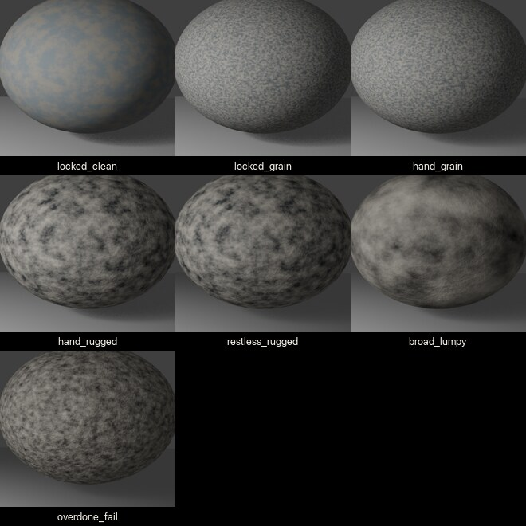

## Learning Recipe: Camera Perspective

Run the matched-framing camera scout:

```bash
/Applications/Blender.app/Contents/MacOS/Blender --background --python examples/camera_perspective_scout.py
```

This uses `blender_workbench.recipes.camera_perspective` to compare lens, foreground anchors, background anchors, floor grid depth, and subject depth as a 5x5 stride sheet. The view stays fundamentally frontal; the scene changes under the view so you can smell toward useful depth parameters. If the sheet looks timid, increase `lens_stride`, `foreground_stride`, `background_stride`, `grid_stride`, or `subject_stride`.

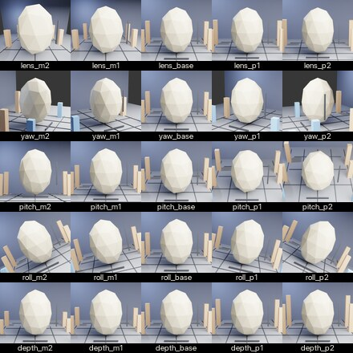

## Learning Recipe: Gobo Lighting

Run the projected-shadow lighting scout:

```bash
/Applications/Blender.app/Contents/MacOS/Blender --background --python examples/gobo_lighting_scout.py
```

This uses `blender_workbench.recipes.gobo_lighting` to compare shadow hardness, blocker distance, gobo pattern, and warm/cool gel color as a dense square tile board.

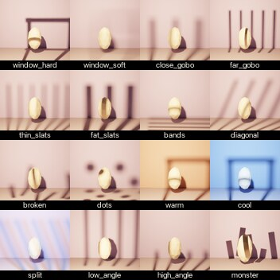

## Learning Recipe: Mesh Lights

Run the emissive geometry lighting scout:

```bash
/Applications/Blender.app/Contents/MacOS/Blender --background --python examples/mesh_light_scout.py
```

This uses `blender_workbench.recipes.mesh_light` to compare emissive mesh size, distance, height, fill, and gel/shape as a 5x5 same-view stride sheet. It is based on the BlenderArt mesh-light and studio pack-shot lessons.

After inspecting the sheet, promote one tile:

```bash
python3 tools/sweep_review_page.py examples/output/mesh_light_scout
/Applications/Blender.app/Contents/MacOS/Blender --background --python examples/mesh_light_scout.py -- --pick mesh_fill_p1
```

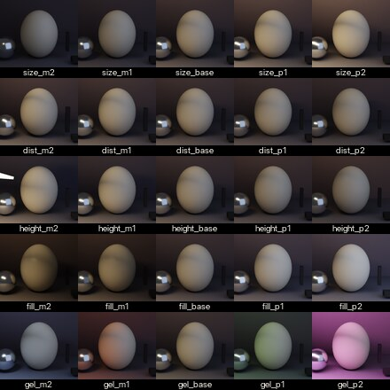

## Learning Recipe: Terrain Environment

Run the landscape/environment mood scout:

```bash
/Applications/Blender.app/Contents/MacOS/Blender --background --python examples/terrain_environment_scout.py
```

This uses `blender_workbench.recipes.terrain_environment` to compare terrain relief, strata contrast, horizon haze, backlight, and foreground scale as a 5x5 same-view stride sheet. It is based on the BlenderArt issue 39 landscape/Europa and virtual-environment prompts.

The recipe uses `blender_workbench.primitives.add_soft_horizon_band` for the low glow card, because hard rectangular haze/light cards can pass in tiny tiles and then fail in the selected hero render.

After inspecting the sheet, promote one tile:

```bash
/Applications/Blender.app/Contents/MacOS/Blender --background --python examples/terrain_environment_scout.py -- --pick terrain_haze_p2
```

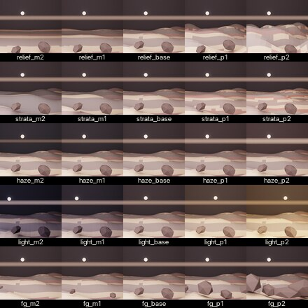

## Learning Recipe: Postprocess Looks

After rendering a selected terrain hero image, run the finishing-look scout:

```bash
python3 examples/postprocess_look_scout.py
```

This uses `blender_workbench.postprocess` to reuse one raw render and compare glow, contrast, saturation, warmth, vignette, and an overdone failure anchor. It is based on the BlenderArt compositing/finishing prompts.

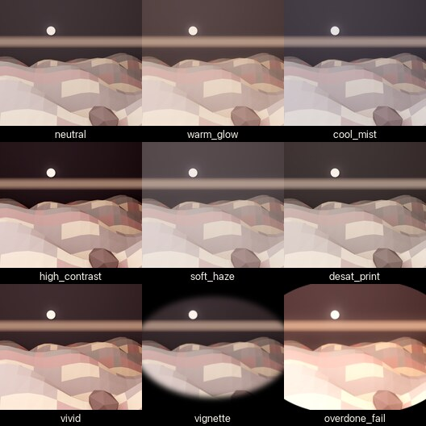

## Learning Recipe: Soft Atmosphere Cards

Run the haze/light-card scout:

```bash
/Applications/Blender.app/Contents/MacOS/Blender --background --python examples/soft_atmosphere_scout.py
```

This uses `blender_workbench.primitives.add_soft_horizon_band` to compare hard-edge failure, falloff width, alpha, glow strength, procedural breakup, and warm/cool color. Use it before adding horizon glow, haze sheets, or stylized light cards to selected renders.

After inspecting the sheet, promote one tile:

```bash
/Applications/Blender.app/Contents/MacOS/Blender --background --python examples/soft_atmosphere_scout.py -- --pick soft_card_base_soft
```

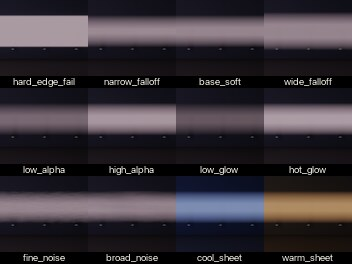

## Learning Recipe: Silhouette Shape

Run the blind shape-first scout:

```bash
/Applications/Blender.app/Contents/MacOS/Blender --background --python examples/silhouette_shape_scout.py
```

This uses unlabeled micro thumbnails so the first judgment is outline readability rather than variant names. Rerun with `-- --labels` to reveal labels, or promote a pick with `-- --pick sil_swept` before material polish.

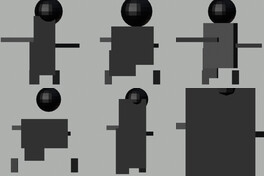

## Learning Recipe: Subsurface

Run the translucent material scout:

```bash
/Applications/Blender.app/Contents/MacOS/Blender --background --python examples/subsurface_scout.py
```

This uses `blender_workbench.recipes.subsurface` to compare subsurface color, scattering radius, material thickness, roughness, backlight, and core light. It deliberately keeps the postprocess off so the sheet reads as a material/lighting test rather than a bloom test.

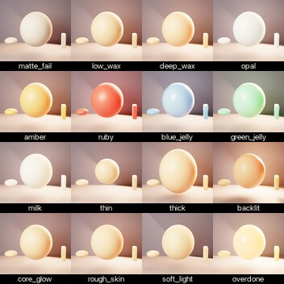

## Learning Recipe: Sunset Haze

Run the ordered dusk/afterglow filmstrip:

```bash
/Applications/Blender.app/Contents/MacOS/Blender --background --python examples/sunset_haze_scout.py
```

This uses the existing `SUNSET_HAZE` axis between flat, over-orange, and washout failure anchors. It is for static atmosphere setup before long-exposure moon trail work.

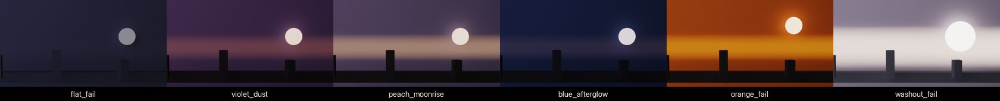

## Learning Recipe: Transparency

Run the transparent material scout:

```bash
/Applications/Blender.app/Contents/MacOS/Blender --background --python examples/transparency_scout.py
```

This uses `blender_workbench.recipes.transparency` to compare alpha, roughness, IOR, pane thickness, and tint as a 5x5 stride sheet. The defaults are intentionally aggressive so distortion, opacity, and tint shifts are visible in tiny tiles. If the sheet looks timid, increase `alpha_stride`, `roughness_stride`, `ior_stride`, `thickness_stride`, or `tint_stride`.

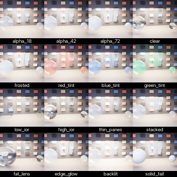

## Featured Recipe: Rocket Plume

Run the stronger plume scout:

```bash
/Applications/Blender.app/Contents/MacOS/Blender --background --python examples/rocket_plume_scout.py
```

This uses `blender_workbench.recipes.rocket_plume` to cross plume alpha/strength with broad vacuum expansion shape. It is a demanding recipe, but the workbench should remain a general sweep tool rather than a rocket-only optimizer.

After inspecting the sheet, promote the best tile:

```bash
/Applications/Blender.app/Contents/MacOS/Blender --background --python examples/rocket_plume_scout.py -- --pick vacuum_balanced_fan
```

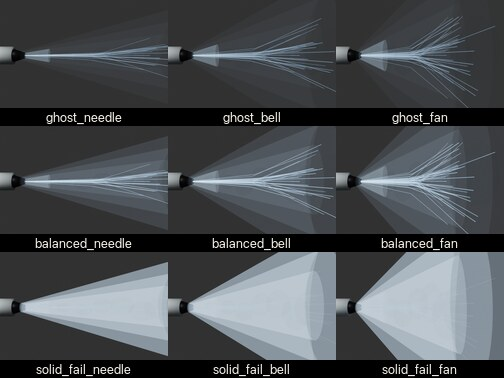

Run the plume density-texture scout:

```bash
/Applications/Blender.app/Contents/MacOS/Blender --background --python examples/rocket_plume_texture_scout.py
```

This scout treats plume texture as spatial density: wisps, clumps, ribbons, and turbulence through the plume volume, not just shader noise on a cone. The overdone region is an aesthetic target; `whiteout_fail` is the true too-far anchor.

After inspecting the texture sheet, promote the chosen density treatment:

```bash
/Applications/Blender.app/Contents/MacOS/Blender --background --python examples/rocket_plume_texture_scout.py -- --pick texture_overdone
```

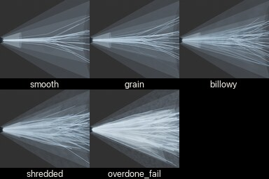
